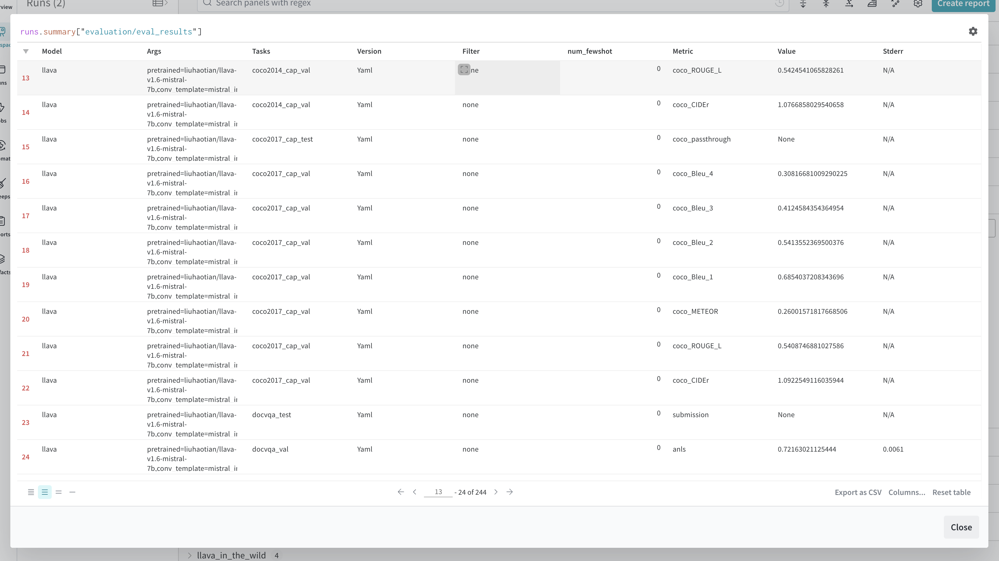
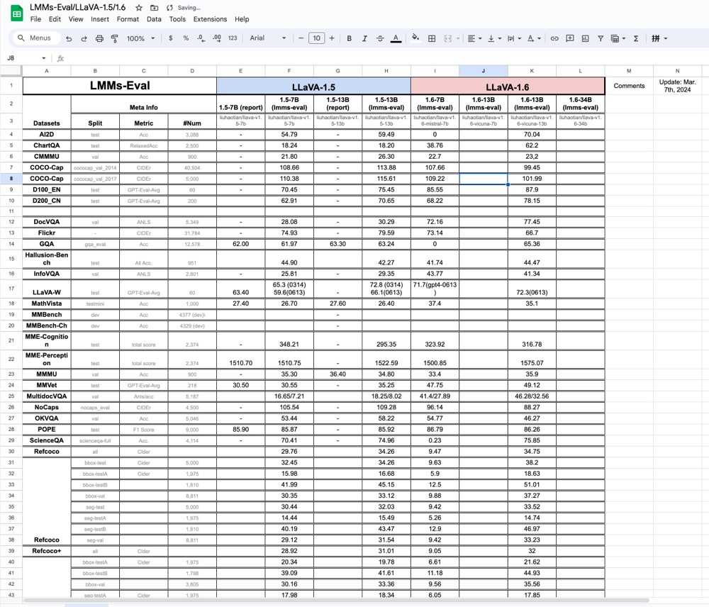

## Introduction

In an era where people pursue AGI (Artificial General Intelligence) with the similar zeal as the moon landing mission, evaluating the foundational large-scale language and multi-modality models with unprecedented capabilities have become a pivotal challenge. To surmount this, a broad spectrum of datasets is essential to assess model capabilities across various dimensions, creating a comprehensive capability chart that reveals the true performance of models. However, evaluation of models has become quite hard since there are countless evaluation benchmarks and datasets organized in various ways, scattered across the internet, sleeping in somebody's Google Drive, Dropbox, and other websites hosted by schools or research labs.

In the field of language models, there has been a valuable precedent set by the work of `lm-evaluation-harness` <d-cite key="eval-harness"></d-cite>. They offer integrated data and model interfaces, enabling rapid evaluation of language models and serving as the backend support framework for the [open-llm-leaderboard](https://huggingface.co/spaces/HuggingFaceH4/open_llm_leaderboard), and has gradually become the underlying ecosystem of the era of large models. 

However, the evaluation of multi-modality models is still in its infancy, and there is no unified evaluation framework that can be used to evaluate multi-modality models across a wide range of datasets. To address this challenge, we introduce **lmms-eval**<d-cite key="lmms_eval2024"></d-cite>, an evaluation framework meticulously crafted for consistent and efficient evaluation of Large-scale Multi-modality Models (LMMs).

We humbly obsorbed the exquisite and efficient design of [lm-evaluation-harness](https://github.com/EleutherAI/lm-evaluation-harness). Building upon its foundation, we implemented our lmms-eval framework with performance optimizations specifically for LMMs.

## Necessity of lmms-eval

We believe our effort is pivotal, providing an efficient interface for the detailed comparison of publicly available models to discern their strengths and weaknesses. It also offers substantial value to research institutions and production-oriented companies to accelerate the development of large-scale multi-modality models.

With the aid of `lmms-eval`, we can proudly say that we have significantly accelerated the lifecycle of model iteration. Inside the LLaVA team, the utilization of `lmms-eval` largely improves the efficiency of the model development cycle, as we are able to quickly identify the strengths and weaknesses of our hundreds of checkpoints produced eack week and evaluate them on 20-30 datasets, and then make targeted improvements.

---

## Important Features

> For more usage guidance, please visit our github repo: https://github.com/EvolvingLMMs-Lab/lmms-eval/tree/main

### One-command evaluation, with detailed logs and samples.
You can evaluate the models on multiple datasets with a single command. No model/data preparation is needed, just one command line, few minutes, and get the results. Not just a result number, but also the detailed logs and samples, including the model args, input question, model response, and ground truth answer.

### Accelerator support and Tasks grouping.
We support the usage of `accelerate` to wrap the model for distributed evaluation, supporting multi-gpu and tensor parallelism. With **Task Grouping**, all instances from all tasks are grouped and evaluated in parallel, which significantly improves the throughput of the evaluation.

Below are the total runtime on different datasets using 4 x A100 40G.
|Dataset (#num)|LLaVA-v1.5-7b|LLaVA-v1.5-13b|
|-------|-------------|--------------|
|mme (2374)    | 2 mins 43 seconds | 3 mins 27 seconds |
|gqa (12578)   | 10 mins 43 seconds | 14 mins 23 seconds |
|scienceqa_img (2017) | 1 mins 58 seconds | 2 mins 52 seconds |
|ai2d (3088)  | 3 mins 17 seconds | 4 mins 12 seconds |
|coco2017_cap_val (5000) | 14 mins 13 seconds | 19 mins 58 seconds |

### All-In-One HF dataset hubs.
We are hosting more than 40 (and increasing) datasets on [huggingface/lmms-lab](https://huggingface.co/lmms-lab), we carefully converted these datasets from original sources and included all variants, versions and splits. Now they can be directly accessed without any burden of data preprocessing. They also serve for the purpose of visualizing the data and grasping the sense of evaluation tasks distribution.

<p align="center" width="100%">

</p>

### Detailed Logging Utilites

We provide detailed logging utilities to help you understand the evaluation process and results. The logs include the model args, generation parameters, input question, model response, and ground truth answer. You can also record every details and visualize them inside runs on Weights & Biases.



## Model Results

As demonstrated by the extensive table below, we aim to provide detailed information for readers to understand the datasets included in lmms-eval and some specific details about these datasets (we remain grateful for any corrections readers may have during our evaluation process).

We provide a Google Sheet for the detailed results of the LLaVA series models on different datasets. You can access the sheet [here](https://docs.google.com/spreadsheets/d/1a5ImfdKATDI8T7Cwh6eH-bEsnQFzanFraFUgcS9KHWc/edit?usp=sharing). It's a live sheet, and we are updating it with new results.



## Supported Models/Datasets

Different models perform best at specific prompt strategies and require models developers skilled knowledge to implement. We prefer not to hastily integrate a model without a thorough understanding to it. Our focus is on more tasks, and we encourage model developers to incorporate our framework into their development process and, when appropriate, integrate their model implementations into our framework through PRs (Pull Requests). Within this strategy, we support a wide range of datasets and selective model series, including:

### Supported models

- GPT4V (API, only generation-based evaluation)
- LLaVA-v1.5/v1.6-7B/13B/34B (ppl-based, generation-based)
- Qwen-VL series (ppl-based, generation-based)
- Fuyu series (ppl-based, generation-based)
- InstructBLIP series (generation-based)

### Supported datasets
> () indicates the task name in the lmms_eval. The task name is also used to specify the dataset in the configuration file.

- AI2D (ai2d)
- ChartQA (chartqa)
- CMMMU (cmmmu)
  - CMMMU Validation (cmmmu_val)
  - CMMMU Test (cmmmu_test)
- COCO Caption (coco_cap)
  - COCO 2014 Caption (coco2014_cap)
    - COCO 2014 Caption Validation (coco2014_cap_val)
    - COCO 2014 Caption Test (coco2014_cap_test)
  - COCO 2017 Caption (coco2017_cap)
    - COCO 2017 Caption MiniVal (coco2017_cap_val)
    - COCO 2017 Caption MiniTest (coco2017_cap_test)
- DOCVQA (docvqa)
  - DOCVQA Validation (docvqa_val)
  - DOCVQA Test (docvqa_test)
- Ferret (ferret)
- Flickr30K (flickr30k)
  - Ferret Test (ferret_test)
- GQA (gqa)
- HallusionBenchmark (hallusion_bench_image)
- Infographic VQA (info_vqa)
  - Infographic VQA Validation (info_vqa_val)
  - Infographic VQA Test (info_vqa_test)
- Internal Eval (internal_eval)
  - D170 CN (d170_cn)
  - D170 EN (d170_en)
  - DC100 EN (dc100_en)
  - DC200 CN (dc200_cn)
- LLaVA-Bench (llava_bench_wild)
- LLaVA-Bench-COCO (llava_bench_coco)
- MathVista (mathvista)
  - MathVista Validation (mathvista_testmini)
  - MathVista Test (mathvista_test)
- MMBench (mmbench)
  - MMBench English (mmbench_en)
    - MMBench English Dev (mmbench_en_dev)
    - MMBench English Test (mmbench_en_test)
  - MMBench Chinese (mmbench_cn)
    - MMBench Chinese Dev (mmbench_cn_dev)
    - MMBench Chinese Test (mmbench_cn_test)
- MME (mme)
- MMMU (mmmu)
  - MMMU Validation (mmmu_val)
  - MMMU Test (mmmu_test)
- MMVet (mmvet)
- Multi-DocVQA (multidocvqa)
  - Multi-DocVQA Validation (multidocvqa_val)
  - Multi-DocVQA Test (multidocvqa_test)
- NoCaps (nocaps)
  - NoCaps Validation (nocaps_val)
  - NoCaps Test (nocaps_test)
- OKVQA (ok_vqa)
  - OKVQA Validation 2014 (ok_vqa_val2014)
- POPE (pope)
- RefCOCO (refcoco)
    - refcoco_seg_test
    - refcoco_seg_val
    - refcoco_seg_testA
    - refcoco_seg_testB
    - refcoco_bbox_test
    - refcoco_bbox_val
    - refcoco_bbox_testA
    - refcoco_bbox_testB
- RefCOCO+ (refcoco+)
    - refcoco+_seg
        - refcoco+_seg_val
        - refcoco+_seg_testA
        - refcoco+_seg_testB
    - refcoco+_bbox
        - refcoco+_bbox_val
        - refcoco+_bbox_testA
        - refcoco+_bbox_testB
- RefCOCOg (refcocog)
    - refcocog_seg_test
    - refcocog_seg_val
    - refcocog_bbox_test
    - refcocog_bbox_val
- ScienceQA (scienceqa_full)
  - ScienceQA Full (scienceqa)
  - ScienceQA IMG (scienceqa_img)
- SeedBench (seedbench)
- SeedBench 2 (seedbench_2)
- ST-VQA (stvqa)
- TextCaps (textcaps)
  - TextCaps Validation (textcaps_val)
  - TextCaps Test (textcaps_test)
- TextVQA (textvqa)
  - TextVQA Validation (textvqa_val)
  - TextVQA Test (textvqa_test)
- VizWizVQA (vizwiz_vqa)
  - VizWizVQA Validation (vizwiz_vqa_val)
  - VizWizVQA Test (vizwiz_vqa_test)
- VQAv2 (vqav2)
  - VQAv2 Validation (vqav2_val)
  - VQAv2 Test (vqav2_test)

### Datasets to be added and tested
- TallyQA (tallyqa)
- VSR (vsr)
- Winoground (winoground)
- NLVR2 (nlvr2)
- RavenIQ-Test (raveniq)
- IconQA (iconqa)
- VistBench (vistbench)

## Citations

```shell
@misc{lmms_eval2024,
    title={LMMs-Eval: Accelerating the Development of Large-scale Multi-modality Models},
    url={https://github.com/EvolvingLMMs-Lab/lmms-eval},
    author={Bo Li, Peiyuan Zhang, Kaicheng Zhang, Fanyi Pu, Xinrun Du, Yuhao Dong, Haotian Liu, Yuanhan Zhang, Ge Zhang, Yue Xiang, Chunyuan Li and Ziwei Liu},
    publisher    = {Zenodo},
    version      = {v0.1.0},
    month={March},
    year={2024}
}
```